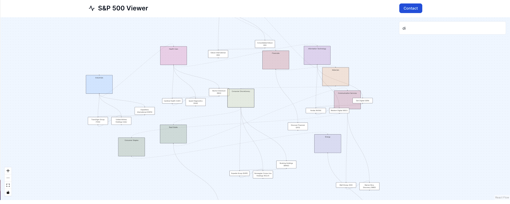

# Graph Visualization Side Project

This project lets a user visualize the S&P 500 companies by viewing company nodes tied together by edges of related companies in the same sector.

## Screenshots



## Technologies Used

This project was created using Next.js, ReactFlow, TypeScript, PostgreSQL, Tailwind, and Vercel.

## Demo

A live hosted version can be found <a href="https://stock-market-graph-visualization.vercel.app/">here</a>

## Run Locally

Clone the project

```bash
  git clone https://github.com/Gabriel416/stock-market-graph-visualization-practice.git
```

Go to the project directory

```bash
  cd stock-market-graph-visualization-practice
```

Install dependencies

```bash
  npm install
```

Start the server

```bash
  npm run dev
```
